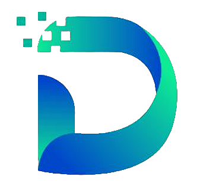

  
    
  <h1>JDG - Juniors Developers Group</h1> 

 

Bem-vindo ao repositório oficial do **JDG - Juniors Developers Group**! Somos um grupo apaixonado por tecnologia e dedicado ao desenvolvimento web, abrangendo tanto a área de front-end quanto a de back-end. Nossa missão é criar um espaço colaborativo e enriquecedor, onde cada membro possa crescer, aprender e compartilhar experiências no vasto mundo da programação web.

## 🌟 Sobre Nós

No JDG, acreditamos no poder da união. Reunimos estudantes comprometidos que desejam marcar a diferença por meio da tecnologia. Nossa motivação vem da busca incessante por desafios e da vontade de causar um impacto positivo. Juntos, alavancamos nossos conhecimentos e habilidades para promover não apenas o nosso desenvolvimento pessoal, mas também o crescimento coletivo.

## 🚀 Nossa Missão

Nossa missão é dupla: fomentar um ambiente colaborativo e incentivar o crescimento individual. Através do trabalho em equipe, aspiramos a superar barreiras e desbravar novas possibilidades. Nosso foco é criar um espaço onde novos horizontes se abram, onde desafios se transformem em oportunidades e onde cada linha de código seja uma contribuição para um futuro digital melhor.

## 💼 O Que Fazemos

No JDG, trabalhamos incansavelmente, voluntariamente e sem fins lucrativos. Nosso esforço está direcionado para projetos que beneficiam a comunidade e geram impacto positivo. Nossas soluções são inovadoras, acessíveis e inclusivas, guiadas pelas melhores práticas de desenvolvimento web. Acreditamos que a tecnologia deve ser um veículo para a inclusão e o progresso.

## 🤝 Nosso Compromisso

Não apenas buscamos o aperfeiçoamento das habilidades técnicas de nossos membros, mas também valorizamos seu crescimento pessoal e profissional. Promovemos uma cultura de compartilhamento de conhecimento, colaboração em equipe e busca constante por aprendizado. Através de workshops, projetos conjuntos e discussões interativas, garantimos que todos tenham a oportunidade de se destacar.

## 🌐 Junte-se a Nós

Se você compartilha de nossa paixão pelo desenvolvimento web e busca um grupo engajado, acolhedor e voltado para o crescimento pessoal, você está no lugar certo. Junte-se a nós para explorar novas possibilidades, enfrentar desafios empolgantes e construir um futuro digital promissor. Vamos crescer juntos, impulsionando uns aos outros rumo ao sucesso.

Conecte-se conosco:
- Website: [www.juniorsdevelopers.com](https://www.juniorsdevelopers.com) 🌐
- Email: juniorsdevelopersgroup@gmail.com  📧
- Redes Sociais: [Instagram](https://www.instagram.com/juniorsdevelopers) 📸 | [Twitter](https://www.twitter.com/juniorsdevs) 🐦 | [LinkedIn](https://www.linkedin.com/company/juniors-developers-group/) 💼

Junte-se ao **JDG - Juniors Developers Group** e faça parte de uma jornada emocionante rumo à excelência no desenvolvimento web. Juntos, podemos transformar códigos em impacto!

## 💡Projetos Recentes
Estamos sempre trabalhando em algo novo e empolgante. Confira alguns dos nossos projetos recentes:

#### Front-end
- [JDG Website](https://github.com/Juniors-Developers-Group-JDG/Site-JDG-Front-End.git) 🌐
- [Hospital Veterinário](https://github.com/Juniors-Developers-Group-JDG/Hospital-Veteririo-Front-End.git) 🐾
- [Rede Social](https://github.com/Juniors-Developers-Group-JDG/Rede-Social-Front-End.git) 📸

#### Back-end
- [JDG Website](https://github.com/Juniors-Developers-Group-JDG/Site-JDG-Front-End.git) ⚙️
- [Hospital Veterinário](https://github.com/Juniors-Developers-Group-JDG/Hospital-Veteririo-Back-End.git) ⚙️

## 🧑‍💻 Contribuidores 
 

<!--   -->

<!-- prettier-ignore -->
<!-- START -->
| [ <b>Ana Clara</b>](https://github.com/anaclaraaraujo)  [🎨](#Design "Design") | [ <b>Ana Elisa</b>](https://github.com/anaelisaq)  [💻](#Code "Code") | [ <b>Bruno Freire</b>](https://github.com/Bruno-freire)  [💻](#Code "Code") | [ <b>Filipe Almeida</b>](https://github.com/filipecalm)  [💻](#Code "Code") | [ <b>Carlos Davi</b>](https://github.com/For-Davi)  [💻](#Code "Code") [👀](#code_review "Reviewed Pull Requests") | [ <b>Gabrielle</b>](https://github.com/GabSantAnna) [💻](#Code "Code") [👀](#code_review "Reviewed Pull Requests") | |
| :---: | :---: | :---: | :---: | :---: | :---: | :---: |

| [ <b>Igor Barbosa</b>](https://github.com/igor93araujo)  [💻](#Code "Code") | [ <b>itsmewt</b>](https://github.com/itsmewt)  [💻](#Code "Code") | [ <b>JAMDev</b>](https://github.com/JamDev0)  [💻](#Code "Code") [👀](#code_review "Reviewed Pull Requests") | [ <b>Jefferson</b>](https://github.com/JeffDoni)  [💻](#Code "Code") | [ <b>Joélisson</b>](https://github.com/JoelissonSS)  [💻](#Code "Code")  [👀](#code_review "Reviewed Pull Requests") | [ <b>Rauane Lima</b>](https://github.com/lRauane) [💻](#Code "Code") [🎨](#Design "Design") | |
| :---: | :---: | :---: | :---: | :---: | :---: | :---: |

| [ <b>Luis Gabriel</b>](https://github.com/luixgabriel)  [💻](#Code "Code") [👀](#code_review "Reviewed Pull Requests") | [ <b>Mateus Cristofori</b>](https://github.com/MateusCristofori)  [💻](#Code "Code") | [ <b>Matheus Bloize</b>](https://github.com/matheusbloize)  [💻](#Code "Code") [👀](#code_review "Reviewed Pull Requests") | [ <b>Matheus Henrique</b>](https://github.com/matheusOliv23)  [💻](#Code "Code") | [ <b>Nicholas Souto</b>](https://github.com/nicholassouto) [💻](#Code "Code") | [ <b>Nathan Mateus</b>](https://github.com/onathanmateus)  [💻](#Code "Code") | |
| :---: | :---: | :---: | :---: | :---: | :---: | :---: |

| [ <b>Paulo Victor</b>](https://github.com/pvcapuano)  [💻](#Code "Code") | [ <b>Wildemberg</b>](https://github.com/renovatt)  [💻](#Code "Code") | [ <b>Romario Alves</b>](https://github.com/Romario-gomes)  [💻](#Code "Code") | [ <b>Thaissa Carvalho</b>](https://github.com/thaissacarvalho)  [💻](#Code "Code") [🎨](#Design "Design") | | | |
| :---: | :---: | :---: | :---: | :---: | :---: | :---: |

#### Expressamos nossa profunda gratidão a todos os colaboradores que fazem parte desse incrível time! 🤝
