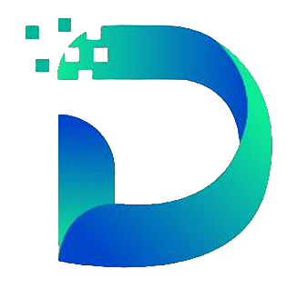

<!DOCTYPE html>
<html lang="en">
<head>
    <meta charset="UTF-8">
    <meta name="viewport" content="width=device-width, initial-scale=1.0">
    <title>JDG - Juniors Developers Group</title>
    
</head>
<body>
    

        
          
        <h1>JDG - Juniors Developers Group</h1> 
    

     

    

    
Bem-vindo ao repositório oficial do <strong>JDG - Juniors Developers Group</strong>! Somos um grupo apaixonado por tecnologia e dedicado ao desenvolvimento web, abrangendo tanto a área de front-end quanto a de back-end. Nossa missão é criar um espaço colaborativo e enriquecedor, onde cada membro possa crescer, aprender e compartilhar experiências no vasto mundo da programação web.

    <h2>🌟 Sobre Nós</h2>

    
No JDG, acreditamos no poder da união. Reunimos estudantes comprometidos que desejam marcar a diferença por meio da tecnologia. Nossa motivação vem da busca incessante por desafios e da vontade de causar um impacto positivo. Juntos, alavancamos nossos conhecimentos e habilidades para promover não apenas o nosso desenvolvimento pessoal, mas também o crescimento coletivo.

    <h2>🚀 Nossa Missão</h2>

    
Nossa missão é dupla: fomentar um ambiente colaborativo e incentivar o crescimento individual. Através do trabalho em equipe, aspiramos a superar barreiras e desbravar novas possibilidades. Nosso foco é criar um espaço onde novos horizontes se abram, onde desafios se transformem em oportunidades e onde cada linha de código seja uma contribuição para um futuro digital melhor.

    <h2>💼 O Que Fazemos</h2>

    
No JDG, trabalhamos incansavelmente, voluntariamente e sem fins lucrativos. Nosso esforço está direcionado para projetos que beneficiam a comunidade e geram impacto positivo. Nossas soluções são inovadoras, acessíveis e inclusivas, guiadas pelas melhores práticas de desenvolvimento web. Acreditamos que a tecnologia deve ser um veículo para a inclusão e o progresso.

    <h2>🤝 Nosso Compromisso</h2>

    
Não apenas buscamos o aperfeiçoamento das habilidades técnicas de nossos membros, mas também valorizamos seu crescimento pessoal e profissional. Promovemos uma cultura de compartilhamento de conhecimento, colaboração em equipe e busca constante por aprendizado. Através de workshops, projetos conjuntos e discussões interativas, garantimos que todos tenham a oportunidade de se destacar.

    <h2>🌐 Junte-se a Nós</h2>

    
Se você compartilha de nossa paixão pelo desenvolvimento web e busca um grupo engajado, acolhedor e voltado para o crescimento pessoal, você está no lugar certo. Junte-se a nós para explorar novas possibilidades, enfrentar desafios empolgantes e construir um futuro digital promissor. Vamos crescer juntos, impulsionando uns aos outros rumo ao sucesso.

    
Conecte-se conosco:

    <ul>
        <li>Website: <a href="https://www.juniorsdevelopers.com">www.juniorsdevelopers.com</a> 🌐</li>
        <li>Email: juniorsdevelopersgroup@gmail.com  📧</li>
        <li>Redes Sociais: <a href="https://www.instagram.com/juniorsdevelopers">Instagram</a> 📸 | <a href="https://www.twitter.com/juniorsdevs">Twitter</a> 🐦 | <a href="https://www.linkedin.com/company/juniors-developers-group/">LinkedIn</a> 💼</li>
    </ul>

    
Junte-se ao <strong>JDG - Juniors Developers Group</strong> e faça parte de uma jornada emocionante rumo à excelência no desenvolvimento web. Juntos, podemos transformar códigos em impacto!

    <h2>💡Projetos Recentes</h2>

    
Estamos sempre trabalhando em algo novo e empolgante. Confira alguns dos nossos projetos recentes:

    <h3>Front-end</h3>
    <ul>
        <li><a href="https://github.com/Juniors-Developers-Group-JDG/Site-JDG-Front-End.git">JDG Website</a> 🌐</li>
        <li><a href="https://github.com/Juniors-Developers-Group-JDG/Hospital-Veteririo-Front-End.git">Hospital Veterinário</a> 🐾</li>
        <li><a href="https://github.com/Juniors-Developers-Group-JDG/Rede-Social-Front-End.git">Rede Social</a> 📸</li>
    </ul>

    <h3>Back-end</h3>
    <ul>
        <li><a href="https://github.com/Juniors-Developers-Group-JDG/Site-JDG-Front-End.git">JDG Website</a> ⚙️</li>
        <li><a href="https://github.com/Juniors-Developers-Group-JDG/Hospital-Veteririo-Back-End.git">Hospital Veterinário</a> ⚙️</li>
    </ul>

    <h2>🧑‍💻 Contribuidores</h2>

    

        <a href="https://github.com/anaclaraaraujo">
            
             
            <b>Ana Clara</b>
        </a>
        <a href="https://github.com/anaelisaq">
            
             
            <b>Ana Elisa</b>
        </a>
        <a href="https://github.com/Bruno-freire">
            
             
            <b>Bruno Freire</b>
        </a>
        <a href="https://github.com/For-Davi">
            
             
            <b>Carlos Davi</b>
        </a>
        <a href="https://github.com/GabSantAnna">
            
             
            <b>Gabrielle</b>
        </a>
        <a href="https://github.com/itsmewt">
            
             
            <b>itsmewt</b>
        </a>
    

    <!-- Add more contributors here -->
    <!-- Copy the above <a> and  blocks and update the details -->

    
Expressamos nossa profunda gratidão a todos os colaboradores que fazem parte desse incrível time! 🤝

</body>
</html>
